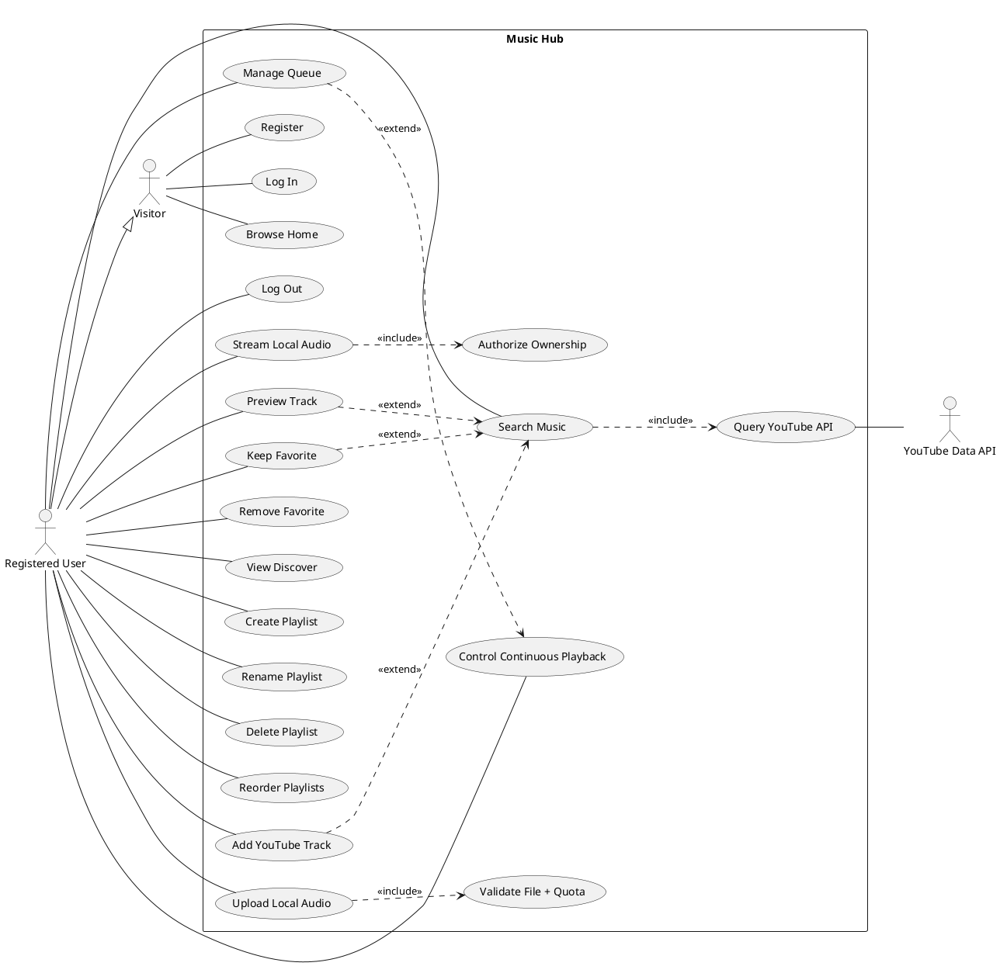

# Music Hub — Project Writeup

## Overview

**Music Hub** is a full-stack web application that turns YouTube into a personal music
library. After creating an account, a user can search YouTube for tracks, preview them
in-app, and save the ones they like to their favorites. From there they organize music
into playlists — creating, renaming, reordering by drag-and-drop, rating songs from one
to ten, and even uploading their own audio files to mix alongside streamed tracks.
Everything plays through a built-in player with a queue that advances automatically, so
listening feels continuous rather than click-by-click.

The application is built as a server-rendered Node.js/Express site using EJS templates
and a SQLite database, with session-based authentication and per-user data isolation.
It was developed as a web-development course final project and is deployed on Render.
Beyond the core feature set, the project emphasizes a polished, accessible light-themed
interface and a hardened backend — parameterized queries, strict ownership checks, and a
locked-down file-upload pipeline — making it a compact but complete demonstration of a
secure, modern web app.

- **Live:** https://music-hub-8pbq.onrender.com/
- **Repo:** https://github.com/Dstarinsky/WebDevCourse-Final-Project

## Tech stack

- **Runtime:** Node.js 24 LTS + Express (server-rendered)
- **Views:** EJS templates + Bootstrap 5, with the custom light-only Sunwashed Broadcast system in `client/css/style.css`
- **Data:** SQLite (`sqlite3`), sessions persisted via `connect-sqlite3`
- **Auth:** `express-session` + `bcryptjs` password hashing
- **Uploads:** `multer` + `file-type` (private, signature-validated local audio)
- **External API:** YouTube Data API v3 for music search
- **Security:** `helmet` (CSP), `csrf-sync` (CSRF tokens), `express-rate-limit`,
  `file-type` (upload content inspection)

## Architecture

The server follows a clean MVC layering:

```
Server/
├── server.js            # routes, middleware, security headers, startup
├── config.js            # validated environment-dependent configuration
├── policies.js          # fixed domain limits and allowlists
├── errors.js            # typed errors carrying their HTTP status
├── validation.js        # reusable boundary validators
├── controllers/         # request handling (Auth, Playlist, Favorite, Media)
├── services/            # business logic (Auth, YouTube, Upload)
├── repositories/        # parameterized, ownership-scoped SQLite access
├── models/              # User, Playlist, PlaylistSong, Favorite
├── middleware/          # auth, csrf, rateLimit, upload, errorHandler
├── database/            # connection, promise adapter, versioned migrations
├── maintenance/         # checksummed backup + recoverable restore
├── scripts/             # maintenance and quality-gate commands
├── security/            # local compromised-password denylist
├── storage/uploads/     # user-uploaded audio — outside the web root
└── views/               # EJS templates + shared partials
client/
├── css/style.css        # design system (tokens, components)
└── js/                  # all page behaviour (no inline script)
```

Controllers stay thin and delegate to services and repositories; all SQL lives in the
repository layer, uses parameterized queries, and scopes every mutation by owner
(`WHERE id = ? AND userId = ?`). Errors are thrown as typed values and translated to
HTTP status codes by one central handler rather than being caught per-method.

The implementation overview and editable diagram index are maintained in
[`docs/architecture-current.md`](docs/architecture-current.md). Draw.io sources cover
architecture, authentication, activity, classes, database schema, and use cases.

Each repeated UI fragment — the page shell, the queue row, a search result, the playlist
list — is defined once as an EJS partial. The browser clones the same partial from a
`<template>` element instead of rebuilding markup as JavaScript strings, so a component
has exactly one definition.

## Security model

- **Ownership** enforced in SQL, resolved once per request by route middleware.
- **Sessions** regenerate on login and store only `{ id, email, firstName }` —
  never the password hash.
- **Passwords** use a 15–128 character policy, local compromised-password checks,
  and a versioned SHA-384 pre-hash before bcrypt so the full accepted value is verified.
- **CSRF** synchronizer tokens on every state-changing route, logout included.
- **Uploads** authorized before any bytes are written, validated by magic bytes rather
  than a spoofable extension or `Content-Type`, quota-limited, stored outside the web
  root, streamed back only through an ownership check, and deleted with their rows.
- **CSP** with no `unsafe-inline` for scripts, which is what extracting the page
  JavaScript out of the templates made possible.

## Notable features

- **YouTube search & favorites** with inline preview.
- **Playlists** — create, rename, delete, drag-and-drop reorder, per-song 0–10 ratings,
  client-side filter and sort.
- **In-place player** — searching, adding, rating, and removing songs happen over
  `fetch` (AJAX) so the currently-playing track is never interrupted by a page reload;
  the player advances automatically through the queue (YouTube and local audio).
- **Persistent Library ↔ Discover playback** — navigation from an active playlist swaps
  Discover content without unmounting the media element, retaining the selected song,
  queue, URL identity, and complete previous/play-pause/next mini-player controls.
- **Responsive light UI** — a compact three-region desktop Library, a full-width mix
  title strip, selective glass, bottom navigation, queue/rating sheets, and a warm
  sunwashed palette tuned for WCAG AA contrast.
- **Distinctive wordmark** — `MUSIC` with a signal underline, a notched `HUB` tag, and
  a compact broadcast identifier on wider screens, all inside the existing slim masthead.

## Use cases

- **Discover and save music** — A listener searches YouTube from inside the app,
  previews results, and saves the ones they like to a favorites collection for later.
- **Build a themed playlist** — A user groups tracks into playlists (e.g. "Focus",
  "Workout"), reorders them by drag-and-drop, and rates songs to remember their picks.
- **Mix streamed and personal audio** — Someone uploads MP3, M4A, OGG/OGA, WAV, FLAC,
  or AAC audio and plays it in the same queue as YouTube tracks.
- **Continuous listening session** — A user starts the set and can move from Library to
  Discover and back, search, add, rate, or remove tracks while the mounted player stays
  alive and the queue auto-advances.
- **Listen across devices** — On a phone, the user opens the playlist drawer, switches
  playlists, and controls playback through the same responsive interface used on desktop.
- **Return to a personal account** — A returning user logs in and finds their private
  favorites and playlists exactly as they left them, isolated from other accounts.

## Use case model (UML)

**Actors**

- **Visitor** — unauthenticated guest.
- **Registered User** — authenticated user; _generalizes_ Visitor (can also do everything a Visitor can).
- **YouTube Data API** — external/secondary actor that fulfills search.

**Use cases by actor**

| Actor            | Use cases                                                                                                                                                                                                                                                                     |
| ---------------- | ----------------------------------------------------------------------------------------------------------------------------------------------------------------------------------------------------------------------------------------------------------------------------- |
| Visitor          | Register, Log In, Browse Home                                                                                                                                                                                                                                                 |
| Registered User  | Log Out · Search Music · Preview Track · Keep / remove favorites · View Discover · Create / rename / delete / reorder playlists · Add YouTube track · Upload local audio · Remove / rate / filter / sort queue items · Control continuous playback · Stream owned local media |
| YouTube Data API | Query YouTube API (participates in _Search Music_)                                                                                                                                                                                                                            |

**Relationships**

- **Generalization:** Registered User ▷ Visitor
- **«include»:** Search Music → Query YouTube API · Upload Local Audio → Validate File and Quota · Stream Local Audio → Authorize Ownership
- **«extend»:** Preview Track → Search Music · Keep Favorite → Search Music · Add YouTube Track → Search Music · Manage Queue → Control Continuous Playback

**Diagram source (PlantUML)**



## Engineering highlights

- **Security:** per-user ownership checks on every playlist/song route (no IDOR),
  parameterized SQL, `httpOnly` + `sameSite=lax` + production-`secure` session cookies,
  server-side input validation, and a hardened upload pipeline — filenames are fully
  server-generated with an audio-extension allowlist, closing a path-traversal →
  arbitrary-file-write → RCE vector.
- **Accessibility:** semantic headings, `alt` text, ARIA labels on icon controls,
  visible focus states, and ≥44px touch targets.
- **Testing:** 75 tests using Node's built-in runner (no test-framework dependency)
  covering auth, CSRF, rate limits, route protection, IDOR, uploads/private media,
  migrations, transaction rollback, YouTube failures, and backup/restore — run with
  `npm test`.

## Running locally

```bash
cd Server
npm ci
npm start          # http://localhost:3000
npm test           # run the test suite
```

Configuration is via `Server/.env` (see `.env.example`): `SESSION_SECRET` and a
`YOUTUBE_API_KEY` for search.
