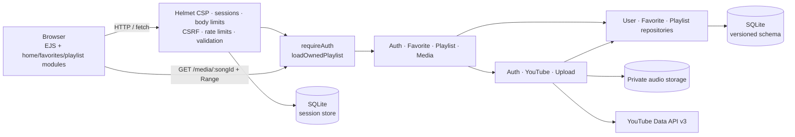
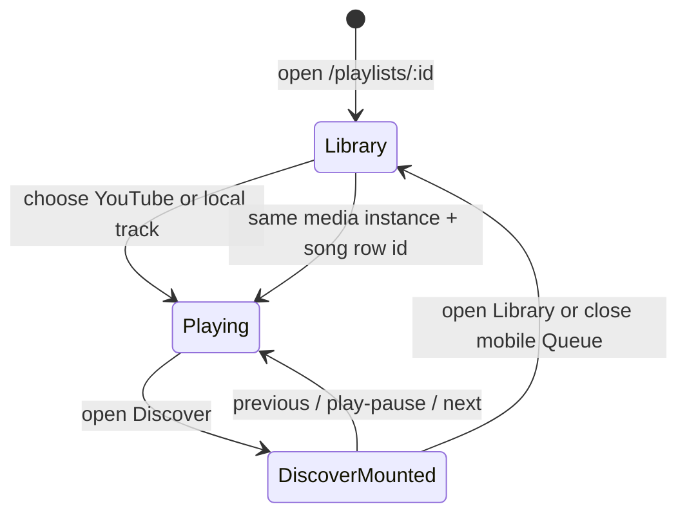
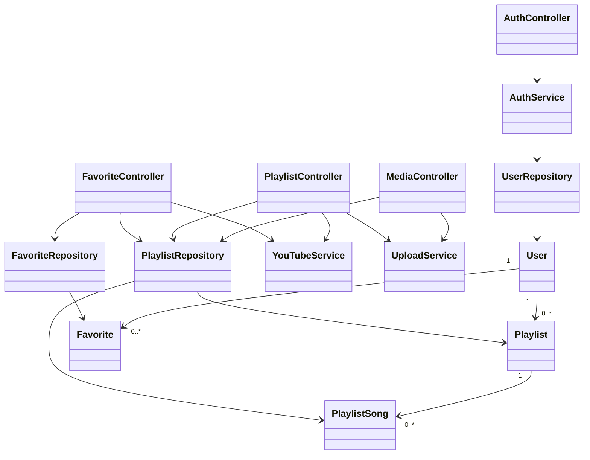
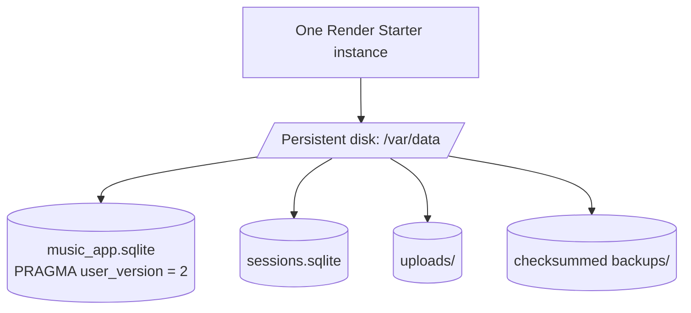

# Music Hub — Current Architecture

Last reconciled with the implementation on **2026-08-11**. This page is the concise
architecture source of truth; the editable Draw.io files beside it provide the detailed
course diagrams.

## Runtime request and data flow

Helmet establishes the CSP before static files or routes. Sessions expose only the public
user projection. Every mutation passes CSRF protection; authentication, search, upload,
and general writes have independent rate policies. Playlist ownership is resolved before
controller mutation, and upload ownership is resolved before Multer accepts bytes.

`MediaController` streams only an owned local song, supports byte ranges, returns the
detected MIME type, and marks the response private and `nosniff`. Uploaded filenames never
reach the browser; client-facing local songs receive `/media/:songId`.

## Persistent client navigation boundary

`client/js/playlist.js` owns the live `YT.Player` or `HTMLAudioElement`. From an active
playlist it fetches Discover markup into `#discover-spa-container` and changes history
state without unloading the document. Returning to Library restores the existing workspace,
the current `playlist_songs.id` deep link, and the complete compact controls. This is an
intentional Library ↔ Discover boundary, not a site-wide background playback service.

## Main code relationships

Controllers are thin and wrapped by the central async/error pipeline. Services own
authentication, upstream YouTube behavior, and private-file policy. Repositories own all
parameterized SQL and consistently construct the four model entities. `User.toPublic()` is
the only user shape allowed in sessions or views; `PlaylistSong.toClient()` hides local
filenames and emits the authorized media URL.

## Persistence, migrations, and operations

Migration 1 rebuilds the canonical constrained schema, removes duplicate favorites, and
creates indexes. Migration 2 purges legacy orphan rows before `foreign_key_check`. Foreign
keys and cascades are enabled; development/production use WAL and a configurable busy
timeout. The server waits for migration completion before listening.

`npm run backup` creates consistent SQLite snapshots, copies uploaded files, and writes a
SHA-256 manifest. `npm run restore -- <path> --confirm` verifies the manifest and moves
current data aside before replacement. `npm run uploads:reconcile` reports missing and
orphaned files; deletion requires `npm run uploads:reconcile:delete`.

## Editable diagram catalog

| Diagram                                     | Draw.io source                                                   | Companion model                                                        |
| ------------------------------------------- | ---------------------------------------------------------------- | ---------------------------------------------------------------------- |
| User activity and continuous playback       | [`activity-diagram.drawio`](activity-diagram.drawio)             | [`activity-diagram.model.xml`](activity-diagram.model.xml)             |
| Runtime architecture and trust boundaries   | [`architecture-diagram.drawio`](architecture-diagram.drawio)     | [`architecture-diagram.model.xml`](architecture-diagram.model.xml)     |
| Registration, login, session, and logout    | [`authentication-diagram.drawio`](authentication-diagram.drawio) | [`authentication-diagram.model.xml`](authentication-diagram.model.xml) |
| Controllers, services, repositories, models | [`class-diagram.drawio`](class-diagram.drawio)                   | [`class-diagram.model.xml`](class-diagram.model.xml)                   |
| Canonical SQLite schema and indexes         | [`database-schema.drawio`](database-schema.drawio)               | [`database-schema-preview.svg`](database-schema-preview.svg) preview   |
| Actors and supported use cases              | [`use-case-diagram.drawio`](use-case-diagram.drawio)             | [`use-case-diagram.model.xml`](use-case-diagram.model.xml)             |

When architecture changes, update the `.drawio` file and its companion model in the same
change, then validate both as XML.
